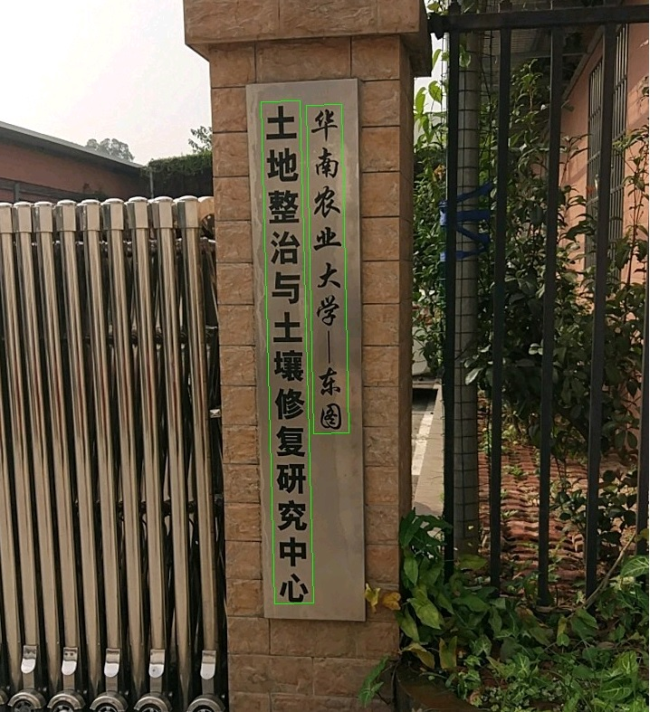

## 基于pytorch的OCR库
***
最近跟新：
- 2020.09.18 更新文本检测说明文档
- 2020.09.12 更新DB,pse,pan,sast,crnn训练测试代码和预训练模型

***
目前已完成:

- [x] DBnet [论文链接](https://arxiv.org/abs/1911.08947)
- [x] PSEnet [论文链接](https://arxiv.org/abs/1903.12473)
- [x] PANnet [论文链接](https://arxiv.org/pdf/1908.05900.pdf)
- [x] SASTnet [论文链接](https://arxiv.org/abs/1908.05498)
- [x] CRNN [论文链接](https://arxiv.org/abs/1507.05717)
***
接下来计划：
- [ ] 训练通用化ocr模型
- [x] 模型转onnx及调用测试
- [ ] 模型压缩（剪枝和量化）
- [ ] 模型蒸馏
- [ ] tensorrt部署
- [ ] 手机端部署
***
### 检测模型效果(实验中)

训练只在ICDAR2015文本检测公开数据集上，算法效果如下：
|模型|骨干网络|precision|recall|Hmean|下载链接|
|-|-|-|-|-|-|
|DB|ResNet50_7*7|85.88%|79.10%|82.35%|[下载链接](https://pan.baidu.com/s/1zONYFPsS3szaf5BHeQh5ZA)(code:fxw6)|
|DB|ResNet50_3*3|86.51%|80.59%|83.44%|[下载链接](https://pan.baidu.com/s/1zONYFPsS3szaf5BHeQh5ZA)(code:fxw6)|
|DB|MobileNetV3|82.89%|75.83%|79.20%|[下载链接](https://pan.baidu.com/s/1zONYFPsS3szaf5BHeQh5ZA)(code:fxw6)|
|SAST|ResNet50_7*7|85.72%|78.38%|81.89%|[下载链接](https://pan.baidu.com/s/1zONYFPsS3szaf5BHeQh5ZA)(code:fxw6)|
|SAST|ResNet50_3*3|86.67%|76.74%|81.40%|[下载链接](https://pan.baidu.com/s/1zONYFPsS3szaf5BHeQh5ZA)(code:fxw6)|
|PSE|ResNet50_7*7|84.10%|80.01%|82.01%|[下载链接](https://pan.baidu.com/s/1zONYFPsS3szaf5BHeQh5ZA)(code:fxw6)|
|PSE|ResNet50_3*3|82.56%|78.91%|80.69%|[下载链接](https://pan.baidu.com/s/1zONYFPsS3szaf5BHeQh5ZA)(code:fxw6)|
|PAN|ResNet18_7*7|81.80%|77.08%|79.37%|[下载链接](https://pan.baidu.com/s/1zONYFPsS3szaf5BHeQh5ZA)(code:fxw6)|
|PAN|ResNet18_3*3|83.78%|75.15%|79.23%|[下载链接](https://pan.baidu.com/s/1zONYFPsS3szaf5BHeQh5ZA)(code:fxw6)|
***
### 模型压缩剪枝效果

这里使用mobilev3作为backbone，在icdar2015上测试结果，未压缩模型初始大小为2.4M.

1. 对backbone进行压缩

|模型|pruned method|ratio|model size(M)|precision|recall|Hmean
|-|-|-|-|-|-|-|
|DB|no|0|2.4|84.04%|75.34%|79.46%|																																																						
|DB|backbone|0.5|1.9|83.74%|73.18%|78.10%|
|DB|backbone|0.6|1.58|84.46%|69.90%|76.50%|

2. 对整个模型进行压缩

|模型|pruned method|ratio|model size(M)|precision|recall|Hmean|
|-|-|-|-|-|-|-|
|DB|no|0|2.4|85.70%|74.77%|79.86%|
|DB|total|0.6|1.42|82.97%|75.10%|78.84%|
|DB|total|0.65|1.15|83.74%|73.18%|78.10%|

***

### 文档教程
- [文本检测](./doc/md/文本检测训练文档.md)
- [文本识别](./doc/md/文本识别训练文档.md)
- [pytorch转onnx](./doc/md/pytorch_to_onnx.md)

***

### 文本检测效果
     

***

### 参考
- https://github.com/PaddlePaddle/PaddleOCR
- https://github.com/whai362/PSENet
- https://github.com/whai362/pan_pp.pytorch
- https://github.com/WenmuZhou/PAN.pytorch
- https://github.com/xiaolai-sqlai/mobilenetv3
- https://github.com/BADBADBADBOY/DBnet-lite.pytorch
- https://github.com/BADBADBADBOY/Psenet_v2
- https://github.com/BADBADBADBOY/pse-lite.pytorch